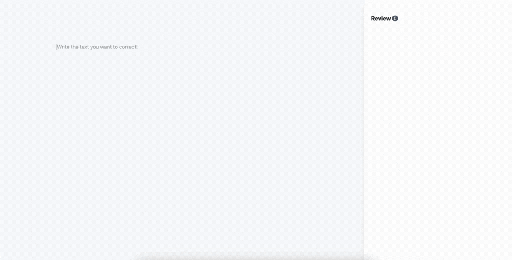

  <h1>Text corrector</h1>

 

  <h3>Elevate your writing quality using AI ✏️</h3>

 
 

## Introduction

This project is a simple tool for identifying and understanding detailed errors in your writing, offering precise corrections, suggestions, and explanations.

### Features:

- Text correction: detailed error identification with suggestions and explanations.
- Exercises: Practice writing skills based on previous errors. (Coming soon)

## Usage

⚠️ If you are using the free tier of the Gemini API, you need to be based in the US to use it, for example, through a VPN.

> For more information, refer to the /client and /api README files.
